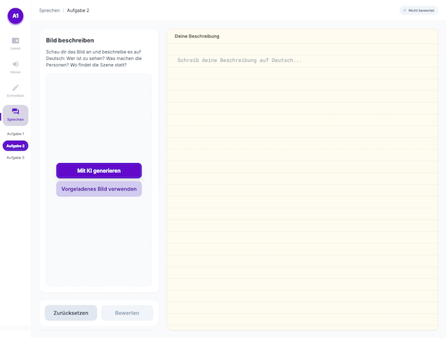
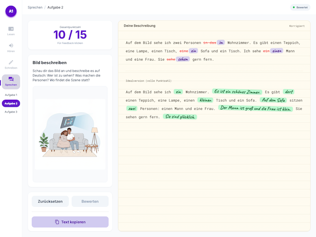
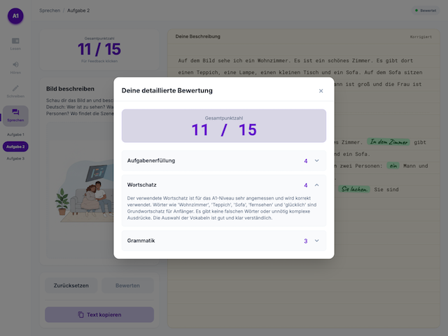

# ÖSD A1 Simulator

> AI-powered practice platform for the ÖSD A1 Zertifikat (Austrian German A1 exam), starting with the Sprechen (Speaking) picture-description task.


## Screenshots





## About

The [ÖSD A1 Zertifikat](https://www.osd.at/) is the entry-level German language certificate issued by the Österreichisches Sprachdiplom Deutsch. Its Sprechen (Speaking) module includes **Aufgabe 2 — "Ein Bild beschreiben"**, where the candidate is shown a picture of an everyday scene and has to describe who is in it, what is happening, and where it takes place.

This project is a sibling of [ielts-simulator](https://github.com/raulito1500/ielts-simulator), reusing the same architecture — a client-only React SPA that calls the Gemini API directly from the browser to generate practice material and grade responses — adapted for the ÖSD A1 exam. The entire UI and exam content are in **German**; this README is in English to stay consistent with the sibling project and standard OSS convention.

## Live Demo

🔗 **[Try it live](https://raulito1500.github.io/osd-a1-simulator)**

## Modules

| Section | Status |
|---------|--------|
| Sprechen — Aufgabe 2 (Bildbeschreibung) | ✅ Live |
| Sprechen — Aufgabe 1 & 3 | 🚧 In development |
| Lesen | 🚧 In development |
| Hören | 🚧 In development |
| Schreiben | 🚧 In development |

## Sprechen — Aufgabe 2 Features

- A wide catalog of everyday-scene prompts (shops, restaurants, workshops, pharmacies, barbecues, hiking, family life at home, the office, moving house) rendered as a fresh image via **Gemini 2.0 Flash** on every click
- Free-text German description, side by side with the picture — no timer, no audio, keeping the MVP focused on reading a scene and writing about it
- AI grading across 3 ÖSD A1-appropriate criteria — **Gemini 2.5 Flash** — Aufgabenerfüllung (task fulfillment), Wortschatz (vocabulary), Grammatik (grammar)
- Handwritten-style inline corrections in the graded text, in German
- Score out of 15 with a detailed, per-criterion feedback panel

## Tech Stack

| Layer | Tech |
|-------|------|
| Framework | React 19 |
| Styling | Tailwind CSS 3 |
| AI Grading | Google Gemini 2.5 Flash |
| Image Generation | Google Gemini 2.0 Flash |
| Deployment | GitHub Pages |

## Getting Started

```bash
git clone https://github.com/raulito1500/osd-a1-simulator.git
cd osd-a1-simulator
npm install
cp .env.example .env   # then add your API key
npm start
```

## API Keys

This app requires a **Google AI Studio** API key for grading and image generation.

1. Go to [Google AI Studio](https://aistudio.google.com/) and create an API key.
2. Add it to your `.env` file:

```
REACT_APP_GEMINI_API_KEY=your_key_here
```

> **Free tier note:** Image generation and grading both work on the free tier, but are subject to Google's per-model rate limits. If a request fails, check your quota at [Google AI Studio](https://aistudio.google.com/).

> **Note on the public demo:** GitHub Pages is static hosting, and Create React App bakes any `REACT_APP_*` variable into the public JS bundle it ships. To avoid leaking a real key, the live demo is built **without** one — AI features are local-only by design. Clone the repo and add your own free key to use them.

## How It Works

1. Click **Mit KI generieren** for a fresh AI-generated picture, or **Vorgeladenes Bild verwenden** to instantly reuse one of the locally cached images (no API call, saves quota).
2. Describe the picture in German in the text panel on the right: who's in it, what they're doing, where it is.
3. Click **Bewerten** — Gemini grades your description across 3 criteria and returns a score out of 15.
4. Click the score card to open detailed, per-criterion feedback with an inline-corrected version of your text, plus a green "Idealversion" showing what to add for a perfect score (still capped at A1 level, so it never suggests vocabulary or grammar beyond what the exam expects).
5. Click **Zurücksetzen** to try a new picture.

## License

MIT — see [LICENSE](LICENSE).
